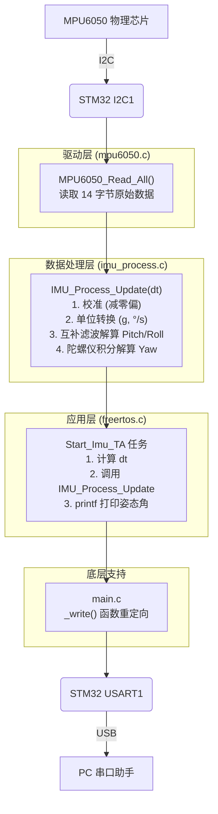

# MPU6050 项目文档

  

本文档基于 `trae.md` 中的开发日志自动生成，旨在对当前项目状态进行全面总结。

  

## 1. 接口文档

  

### 1.1 文件结构与职责

  

| 文件路径 | 核心职责 |

| :--- | :--- |

| `App/Inc/mpu6050.h` | **MPU6050 驱动头文件**。定义硬件层接口，负责与芯片进行 I2C 通信。 |

| `App/Src/mpu6050.c` | **MPU6050 驱动实现文件**。实现 `MPU6050_Init` 和 `MPU6050_Read_All`，直接操作硬件。 |

| `App/Inc/imu_process.h` | **IMU 数据处理头文件**。定义数据处理层接口、核心数据结构 `IMU_Data_t` 及姿态解算算法。 |

| `App/Src/imu_process.c` | **IMU 数据处理实现文件**。**项目的算法核心**。实现从数据校准到互补滤波姿态解算的全过程。 |

| `Core/Src/main.c` | **主程序入口**。负责 MCU 和外设初始化、FreeRTOS 启动、`printf` 重定向。 |

| `Core/Src/freertos.c` | **FreeRTOS 任务定义与实现**。负责任务调度，计算精确的 `dt`，调用数据处理层，并输出最终姿态数据。 |

  

### 1.2 函数接口 (API)

  

#### `mpu6050.h`

  

* `void MPU6050_Init(I2C_HandleTypeDef *hi2c)`

* **功能**: 初始化 MPU6050 传感器，包括唤醒传感器、设置陀螺仪和加速度计的量程。

* **参数**: `I2C_HandleTypeDef *hi2c` - I2C 外设句柄。

  

* `void MPU6050_Read_All(I2C_HandleTypeDef *hi2c, int16_t *accel, int16_t *gyro)`

* **功能**: 一次性读取加速度计和陀螺仪三个轴的全部原始数据。

* **参数**:

* `I2C_HandleTypeDef *hi2c`: I2C 句柄。

* `int16_t *accel`: 长度为 3 的数组，用于存储原始加速度数据。

* `int16_t *gyro`: 长度为 3 的数组，用于存储原始陀螺仪数据。

  

#### `imu_process.h`

  

* `void IMU_Process_Init(I2C_HandleTypeDef *hi2c)`

* **功能**: 初始化并执行 IMU 的静态校准。通过上电采集 500 个样本计算并存储陀螺仪和加速度计的零点偏移。

* **参数**: `I2C_HandleTypeDef *hi2c` - I2C 句柄。

  

* `void IMU_Process_Update(I2C_HandleTypeDef *hi2c, IMU_Data_t *data, float dt)`

* **功能**: 核心函数。获取最新的传感器数据，并进行姿态解算。

* **执行流程**:

1. 读取原始数据。

2. 减去零点偏移。

3. 转换为物理单位（g, °/s）。

4. 使用 `atan2f` 基于加速度计数据计算 Pitch 和 Roll。

5. 通过互补滤波算法，融合陀螺仪积分和加速度计角度，更新 Pitch 和 Roll。

6. 对 Z 轴陀螺仪进行积分，更新 Yaw。

* **参数**:

* `I2C_HandleTypeDef *hi2c`: I2C 句柄。

* `IMU_Data_t *data`: 指向用于存储最终姿态结果的数据结构。

* `float dt`: 时间间隔（秒），由 `freertos.c` 任务精确计算。

  

### 1.3 关键变量

  

| 变量名 | 定义位置 | 类型 | 作用 |

| :--- | :--- | :--- | :--- |

| `hi2c1` | `i2c.c` | `I2C_HandleTypeDef` | I2C1 外设句柄，贯穿驱动、处理、应用三层。 |

| `gyro_bias`, `accel_bias` | `imu_process.c` | `static float[3]` | 存储静态校准计算出的零点偏移，仅在模块内部可见。 |

| `imu_data` | `freertos.c` | `IMU_Data_t` | 在 `Imu_TA` 任务中，存储最终的 IMU 数据，包括加速度、角速度和姿态角。 |

| `last_tick` | `freertos.c` | `uint32_t` | 在 `Imu_TA` 任务中，用于存储上一帧的系统 tick，以计算精确的 `dt`。 |

  

## 2. 技术、方法与算式

  

### 2.1 使用的技术

  

* **FreeRTOS**: 用于多任务管理，将 IMU 数据处理 (`Imu_TA`) 与其他任务分离，保证系统实时性。

* **I2C 通信**: 用于 STM32 与 MPU6050 传感器之间的数据传输。

* **`printf` 重定向**: 通过重写 `_write` 函数，将 `printf` 的输出流导向 `USART1`，方便调试。

* **CMake 构建系统**: 用于管理项目编译和链接，方便添加新文件。

  

### 2.2 核心算法与方法

  

* **零偏校准**:

* **方法**: 在系统初始化时，静态放置传感器，连续读取 N (500) 次数据，计算各轴的平均值作为零点偏移量 (Bias)。

* **算式**: `Bias = (sum(sample_1, ..., sample_N)) / N`

* **注意**: Z 轴加速度计的偏移需要额外减去重力加速度（1g）对应的理论值。

  

* **单位转换**:

* **方法**: 将减去零偏后的原始数据，除以传感器手册提供的灵敏度，得到带物理单位的浮点数值。

* **算式**:

* `Accel (g) = (Raw_Accel - Accel_Bias) / ACCEL_SENSITIVITY`

* `Gyro (°/s) = (Raw_Gyro - Gyro_Bias) / GYRO_SENSITIVITY`

* **常量**: `ACCEL_SENSITIVITY = 16384.0f` (for ±2g), `GYRO_SENSITIVITY = 16.4f` (for ±2000dps)。

  

* **动态 `dt` 计算**:

* **方法**: 在 `Imu_TA` 任务循环中，使用 `osKernelGetTickCount()` 获取当前系统 tick，与上一帧的 tick 相减，得到时间差，并转换为秒。

* **算式**: `dt = (current_tick - last_tick) / osKernelGetTickFreq()`

  

* **姿态解算 (互补滤波)**:

* **方法**: 融合陀螺仪的短期精确性和加速度计的长期稳定性。

* **步骤**:

1. **加速度计计算角度**: 使用 `atan2f` 从加速度分量计算 Pitch 和 Roll。这是姿态的“绝对”参考，但在动态时不可靠。

* `Roll_acc = atan2f(Accel_Y, Accel_Z) * 180.0f / PI`

* `Pitch_acc = atan2f(-Accel_X, sqrt(Accel_Y*Accel_Y + Accel_Z*Accel_Z)) * 180.0f / PI`

2. **陀螺仪积分角度**: 将角速度乘以 `dt` 累加，得到角度变化。这在短期内非常准确，但长期存在积分漂移。

* `Pitch_gyro += Gyro_X * dt`

3. **互补滤波融合**: 将两者按权重相加。

* **算式**: `Angle = K * (Angle_prev + Gyro_rate * dt) + (1 - K) * Angle_acc`

* **权重**: `K = 0.98` (信任陀螺仪)， `1 - K = 0.02` (用加速度计校正)。

* **航向角 (Yaw)**:

* **方法**: 由于没有磁力计，Yaw 角只能通过 Z 轴陀螺仪积分获得。

* **算式**: `Yaw += Gyro_Z * dt`

  

## 3. 数据流梳理

  



  

**详细步骤**:

  

1. **任务调度与 `dt` 计算**: `Start_Imu_TA` 任务被 RTOS 唤醒，并根据系统 tick 计算出与上一帧的精确时间差 `dt`。

2. **数据更新请求**: `Start_Imu_TA` 调用 `IMU_Process_Update` 函数，传入 `dt`，请求一次新的姿态数据。

3. **硬件读取**: `IMU_Process_Update` 内部调用 `MPU6050_Read_All`，通过 I2C 从芯片获取 14 字节的原始数据。

4. **数据处理与姿态解算**: `IMU_Process_Update` 执行完整的算法流程：校准、单位转换、互补滤波（融合陀螺仪积分和加速度计角度）和航向角积分，将最终的 Pitch, Roll, Yaw 存入 `IMU_Data_t` 结构体。

5. **返回结果**: `IMU_Process_Update` 执行完毕，`IMU_Data_t` 结构体中已填充好最新的姿态角。

6. **格式化输出**: `Start_Imu_TA` 任务调用 `printf`，将 `IMU_Data_t` 中的姿态角（浮点数）格式化为字符串。

7. **串口发送**: `printf` 通过 `_write` 函数和 `HAL_UART_Transmit`，将字符串通过 USART1 发送出去。

8. **最终显示**: PC 串口助手显示实时的 Pitch, Roll, Yaw 角度。

  

## 4. 当前状态能做到什么

  

根据 `trae.md` 的最终阶段总结，当前系统已经能够：

  

1. **稳定输出姿态角**: 成功解算出稳定、实时、准确的 Pitch（俯仰角）和 Roll（横滚角）。

2. **动态响应**: 输出的姿态角能够灵敏地反映模块的物理姿态变化。

3. **工程可用**: 输出的数据质量达到了工程可用的标准，可以用于后续的控制或显示任务。

4. **航向角输出**: 能够输出一个基于陀螺仪积分的航向角（Yaw），但存在漂移。

  

## 5. 现存有什么问题

  

当前系统最主要的问题是：

  

* **航向角 (Yaw) 漂移**: 由于仅使用陀螺仪积分来计算航向角，无法修正其固有的积分误差，导致 Yaw 角会随着时间慢慢漂移。这是 6 轴 IMU 的固有局限性。

* **解决方法**: 要解决此问题，需要引入一个绝对的方向参考，通常是**磁力计**。通过融合磁力计数据（如使用更复杂的 AHRS 算法），才能获得一个长期稳定的、无漂移的航向角，将系统从 6 轴升级为 9 轴。
	* 已经购买了磁力计，ak09911c


# 成功！

1. 6_Mpu6050_t1![[Pasted image 20260409165044.png]]
2. imu_node.py![[Pasted image 20260409165129.png]]
3. rviz2![[Pasted image 20260409165231.png]]![[Pasted image 20260409165257.png]]
4. rqt_console&rqt_graph![[Pasted image 20260409165334.png]]
5. terminal![[Pasted image 20260409165420.png]]
6. 大部分成功之前的数据，存在”/home/lin/Lin_workspace/6_Mpu6050t1_ws/doc/result.md“
	1. hz
	2. tf
		1. tf-hz
	3. 数据格式
	4. 
7. frame![[Pasted image 20260409165902.png]]

## terminator查找历史指令记录
https://chatgpt.com/c/69d71c3e-9d68-8322-b1d6-a8b5c594354f

> [!NOTE]
> 在 **Terminator** 里查看历史命令，其实本质是用 **Shell 的历史记录功能（bash/zsh）**，不是 Terminator 自己的功能。
> 
> 我给你几种最常用、最实用的方法👇
> 
> ---
> 
> # 🚀 ✅ 方法1：方向键（最简单）
> 
> 👉 按：
> 
> - ⬆️ 上箭头 → 上一条命令
>     
> - ⬇️ 下箭头 → 下一条命令
>     
> 
> 👉 适合快速翻最近命令
> 
> ---
> 
> # 🔍 ✅ 方法2：history 命令（最常用）
> 
> ```bash
> history
> ```
> 
> 👉 会显示类似：
> 
> ```text
> 1001  ros2 topic list
> 1002  cd ~/workspace
> 1003  colcon build
> ```
> 
> ---
> 
> ## 🎯 搭配 grep 精确查找（强烈推荐）
> 
> ```bash
> history | grep ros2
> ```
> 
> 👉 只看 ROS2 相关命令
> 
> ---
> 
> # ⚡ ✅ 方法3：Ctrl + R（神器）
> 
> 👉 按：
> 
> ```text
> Ctrl + R
> ```
> 
> 然后输入关键词：
> 
> ```text
> (reverse-i-search)`ros2': ros2 topic list
> ```
> 
> 👉 再按：
> 
> - `Ctrl + R` → 继续往前找
>     
> - `Enter` → 执行
>     
> - `→` → 编辑后再执行
>     
> 
> ---
> 
> # 📜 ✅ 方法4：查看历史文件
> 
> ```bash
> cat ~/.bash_history
> ```
> 
> 👉 所有历史命令都在这里
> 
> ---
> 
> # 🧠 补充：Terminator滚屏历史（不是命令历史）
> 
> 如果你想看“之前终端输出”：
> 
> 👉 用：
> 
> ```text
> Shift + PageUp
> Shift + PageDown
> ```
> 
> 或者滚轮
> 
> ---
> 
> # 🎯 总结（你最该记住的）
> 
> |场景|方法|
> |---|---|
> |找刚刚命令|↑|
> |查所有历史|`history`|
> |精确搜索|`history|
> |快速搜索|**Ctrl + R（最强）**|
> 
> ---
> 
> # 💡 给你一个ROS专用技巧
> 
> 以后你可以这样：
> 
> ```bash
> history | grep ros2
> ```
> 
> 👉 快速找你之前跑过的：
> 
> - `ros2 run`
>     
> - `ros2 topic`
>     
> - `ros2 launch`
>     
> 
> ---
> 
> 如果你想，我还能教你一个更高级的👇
> 
> 👉 **让历史命令带时间 + 永久保存 + 多终端同步**（开发必备）


#### 步骤
ros2 run tf2_ros static_transform_publisher 0 0 0 0 0 0 map imu_link
ros2 run tf2_ros tf2_echo map imu_link

ros2 topic echo /tf_static
ros2 run imu_serial imu_node 
ls /dev/ttyACM*

##### 查看当前terminator历史记录命令
history

---
#### ros2 topic echo /imu/data

#### rviz2初始配置
sudo apt install ros-humble-rviz-imu-plugin

sudo apt install ros-humble-imu-tools
sudo apt install ros-humble-robot-localization
## 部署无线串口，实现实验室内径向10.2m的数据回传，可以确保数据有效
#回顾/复现 

### 成功在树梅派(4b-8gb/64gb)端侧实现imu数据在rviz2中显示，但是太卡了，只是做验证就死机过
ros2 run tf2_ros static_transform_publisher \  
0 0 0 0 0 0 base_link imu_link
imu_link

#### 实现，树梅派运行与vmware看rviz2实现
https://chatgpt.com/c/69db8750-a7a8-83e8-bec1-8c76e84186d8

> [!NOTE]
> # 三、最核心配置（你刚问的那部分）
> 
> ## ✅ 两端都要设置
> 
> ---
> 
> ## 🌿 树莓派端：
> 
> export ROS_DOMAIN_ID=0  
> export RMW_IMPLEMENTATION=rmw_fastrtps_cpp
> 
> ---
> 
> ## 💻 PC端：
> 
> export ROS_DOMAIN_ID=0  
> export RMW_IMPLEMENTATION=rmw_fastrtps_cpp

##### 总结

> [!NOTE]
> 好，这一段我帮你做一个**工程级总结**，让你以后可以直接当“脑图入口”用。
> 
> ---
> 
> # 一、完整总结（从现象 → 本质 → 扩展）
> 
> ## 1️⃣ 你刚完成了什么（表象）
> 
> 你实现了：
> 
> ```text
> 树莓派发布IMU → PC远程RViz2显示
> ```
> 
> 并且通过：
> 
> ```bash
> export ROS_DOMAIN_ID=0
> export RMW_IMPLEMENTATION=rmw_fastrtps_cpp
> ```
> 
> 打通了通信
> 
> ---
> 
> ## 2️⃣ 本质发生了什么（核心认知）
> 
> 你实际上用到了：
> 
> 👉 DDS
> 
> ROS2的底层机制：
> 
> ```text
> 节点 ≠ 直接通信
> 节点 → DDS → 自动发现 → 建立连接
> ```
> 
> ---
> 
> ### 核心两个变量：
> 
> #### ✅ ROS_DOMAIN_ID
> 
> ```text
> 作用：网络隔离（像频道）
> ```
> 
> - 相同 → 能通信
>     
> - 不同 → 完全隔离
>     
> 
> ---
> 
> #### ✅ RMW_IMPLEMENTATION
> 
> ```text
> 作用：选择DDS实现（通信引擎）
> ```
> 
> 常见：
> 
> - FastDDS（默认）
>     
> - Cyclone DDS（更推荐）
>     
> 
> ---
> 
> 👉 本质总结：
> 
> ```text
> ROS2通信 = DDS + Domain + Middleware
> ```
> 
> ---
> 
> ## 3️⃣ 为什么这种方式“很好用”
> 
> 你用的是：
> 
> ```text
> DDS 自动发现机制
> ```
> 
> 特点：
> 
> - 无需IP配置 ✅
>     
> - 自动找节点 ✅
>     
> - 插网即用 ✅
>     
> 
> 👉 这就是你感觉“很高级”的原因
> 
> ---
> 
> ## 4️⃣ 你解决了什么关键工程问题
> 
> ### ❌ 原问题
> 
> - 树莓派跑 RViz → 9 FPS + 崩溃
>     
> - TF错误 → IMU丢数据
>     
> 
> ---
> 
> ### ✅ 现在
> 
> - 树莓派只负责“数据生产”
>     
> - PC负责“可视化计算”
>     
> 
> 👉 架构升级为：
> 
> ```text
> 分布式机器人系统
> ```
> 
> ---
> 
> ## 5️⃣ 同类技术（你后面一定会用）
> 
> 按“进阶路线”给你排好👇
> 
> ---
> 
> ### 🟢 第一层（你现在）
> 
> - DDS自动发现 ✅
>     
> - 多机ROS2通信 ✅
>     
> 
> ---
> 
> ### 🔵 第二层（稳定性优化）
> 
> #### ① 切换中间件
> 
> ```bash
> export RMW_IMPLEMENTATION=rmw_cyclonedds_cpp
> ```
> 
> 👉 更稳、更低延迟
> 
> ---
> 
> #### ② 网络控制
> 
> ```bash
> export ROS_LOCALHOST_ONLY=0
> ```
> 
> 👉 控制是否跨机器通信
> 
> ---
> 
> ---
> 
> ### 🟡 第三层（工程级）
> 
> #### ③ QoS设计（非常关键）
> 
> 控制：
> 
> - 丢不丢数据
>     
> - 延迟
>     
> - 实时性
>     
> 
> ---
> 
> #### ④ DDS Discovery Server
> 
> 👉 类似 ROS1 的 roscore，但更强
> 
> 适合：
> 
> - 多机器人
>     
> - 大规模系统
>     
> 
> ---
> 
> ---
> 
> ### 🔴 第四层（系统级扩展）
> 
> #### ⑤ micro-ROS
> 
> 👉 micro-ROS
> 
> ```text
> STM32 → 直接进ROS2网络
> ```
> 
> ---
> 
> #### ⑥ Web / 云控制
> 
> 👉 rosbridge_suite
> 
> ```text
> 浏览器控制机器人
> ```
> 
> ---
> 
> #### ⑦ 跨网络控制（WAN）
> 
> - VPN
>     
> - DDS Router
>     
> 
> ---
> 
> ## 6️⃣ 你当前所在阶段（非常关键）
> 
> 你现在是：
> 
> ```text
> ✅ 多机通信（已完成）
> ➡️ 下一步：状态融合 + 建图
> ```
> 
> ---
> 
> ## 7️⃣ 正确的下一步（强烈建议）
> 
> ### ✅ Step 1
> 
> ```text
> IMU + 编码器 → EKF
> ```
> 
> 用：
> 
> 👉 robot_localization
> 
> ---
> 
> ### ✅ Step 2
> 
> ```text
> odom + 激光雷达 → SLAM
> ```
> 
> （你已有 LD06）
> 
> ---
> 
> ### ✅ Step 3
> 
> ```text
> 完整链路：
> 
> cmd_vel
>  → 运动学
>  → CAN
>  → 电机
>  → 反馈
>  → odom
>  → SLAM
> ```
> 
> ---
> 
> # 二、一句话标题（你要的）
> 
> ```text
> ROS2分布式通信本质：基于DDS的自动发现与多机协同系统
> ```
> 
> ---
> 
> 如果你下一步要继续，我建议直接做这个👇（最关键分水岭）：
> 
> 👉 **EKF配置 + TF树一次性设计正确（避免后面全部推翻）**
> 
> 我可以帮你把这块直接“工程级模板化”。

#### 切换中间件可行（FastDDS（rmw_fastrtps_cpp）->CycloneDDS（rmw_cyclonedds_cpp））
ros2 doctor --report | grep cyclonedds
sudo apt install ros-humble-rmw-cyclonedds-cpp

export RMW_IMPLEMENTATION=rmw_cyclonedds_cpp  
export ROS_DOMAIN_ID=0

echo $RMW_IMPLEMENTATION

##### rasp4端侧资源占用很小
