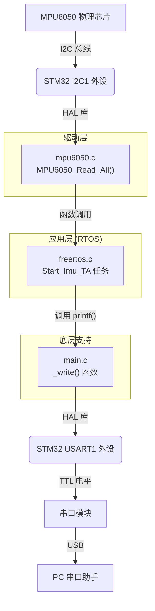
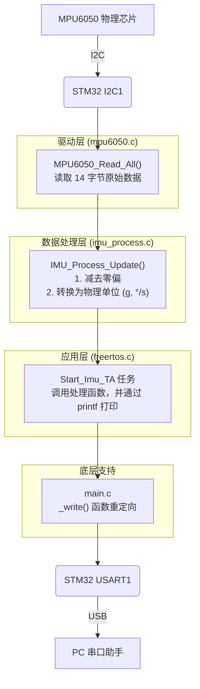
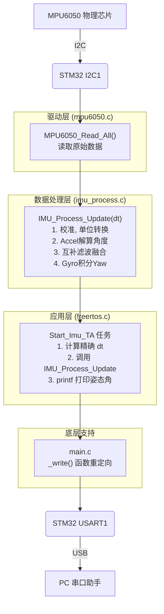
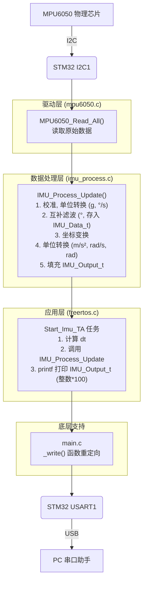

## 260403
https://chatgpt.com/c/69cee05d-c0b0-83e8-a4d1-f06014dfe11b


> [!NOTE]
> 你这个判断是对的，而且已经踩在一个很关键的点上了：
> 
> > ✅ 你现在这份 `claude.md`，本质上就是**“接口文档 + 模块说明书”**
> > 但——
> > ❗还缺一层：**“系统约束 + 控制语义”**
> 
> 我帮你把这个问题彻底讲透，并给你一个**工程级三层文档体系（非常适合你）**👇
> 
> ---
> 
> # 一、你现在的理解：对，但不完整
> 
> 你说它像“接口文档”，没错，但机器人系统里需要的是：
> 
> ---
> 
> ## 🧱 三层文档模型（这是关键）
> 
> ### 1️⃣ 系统约束层（System Spec）👉 全局
> 
> 定义：
> 
> * 系统能做什么 / 不能做什么
> * 当前阶段
> * 控制优先级
> 
> 👉 类似：
> 
> > 软件工程里的：架构设计说明 / 系统约束
> 
> ---
> 
> ### 2️⃣ 模块接口层（Interface Spec）👉 你现在这个
> 
> 定义：
> 
> * 模块职责
> * 输入输出
> * 数据流
> * 任务调度
> * 函数 / 变量
> 
> 👉 类似：
> 
> > 你说的“接口文档” ✔（完全正确）
> 
> ---
> 
> ### 3️⃣ 控制语义层（Control Semantics）👉 你现在缺的
> 
> 定义：
> 
> * 控制对象是什么（速度？角度？）
> * 控制链路（闭环结构）
> * 精度/频率/限制
> 
> 👉 类似：
> 
> > 控制系统设计说明（很多人忽略）
> 
> ---
> 
> # 二、你现在的文档处于哪一层？
> 
> 你当前 `claude.md`：
> 
> | 层级   | 状态   |
> | ---- | ---- |
> | 系统约束 | ❌ 缺失 |
> | 接口文档 | ✅ 很强 |
> | 控制语义 | ❌ 缺失 |
> 
> ---
> 
> # 三、为什么“接口文档”不够？
> 
> 这是重点，我直接讲工程真相：
> 
> ---
> 
> ## ❗问题1：接口 ≠ 能力
> 
> 你定义了：
> 
> * `g_motor_status`
> * CAN协议
> * 任务流
> 
> 但没有定义：
> 
> > 👉 **这些东西“能做到什么程度”**
> 
> ---
> 
> ## ❗问题2：AI会默认“能力最大化”
> 
> 没有限制时，AI默认：
> 
> > 你这个系统 = 工业级电机控制
> 
> 于是它会：
> 
> * 推荐复杂控制 ❌
> * 推荐多环控制 ❌
> * 推荐轨迹规划 ❌
> 
> ---
> 
> ## ❗问题3：控制系统必须定义“语义”
> 
> 举个例子：
> 
> ```c
> target_speed → PID → pwm
> ```
> 
> 这只是结构
> 
> 但你没说：
> 
> * 单位是什么？
> * 精度是多少？
> * 更新频率是多少？
> * 是否稳定？
> 
> 👉 这就是“控制语义缺失”
> 
> ---
> 
> # 四、你应该怎么做（最优方案）
> 
> 你现在这份文档不用推翻，只需要**升级为“三段式”**
> 
> ---
> 
> ## ✅ 推荐结构（直接可用）
> 
> ---
> 
> ### 🧠 第一层：系统约束（新增）
> 
> 放最前面👇
> 
> ```markdown
> # 系统约束（最高优先级）
> 
> 当前阶段：
> - 仅实现单电机速度控制
> 
> 能力边界：
> - 编码器：13PPR → 低精度
> - 无位置控制能力
> - 无角度控制能力
> 
> 禁止：
> - 多电机协同
> - 轨迹控制
> - ROS逻辑接入
> 
> 优先级：
> > 控制稳定性 > 功能扩展
> ```
> 
> ---
> 
> ### 🔌 第二层：接口文档（你已有 ✔）
> 
> 你现在这部分：
> 
> * 目录结构 ✔
> * CAN协议 ✔
> * 任务流 ✔
> * 变量 ✔
> 
> 👉 保持不动（已经很好）
> 
> ---
> 
> ### ⚙️ 第三层：控制语义（必须新增）
> 
> 加在“任务流”后👇
> 
> ```markdown
> ## 控制语义（核心）
> 
> 控制目标：
> - 目标：稳定速度控制（非精确）
> 
> 控制结构：
> target_speed → PID → pwm → motor → encoder → current_speed
> 
> 控制参数：
> - 控制周期：约 10ms
> - 反馈来源：编码器计数（低分辨率）
> - 输出：PWM占空比
> 
> 限制：
> - 低速不稳定（静摩擦）
> - 高速误差较大
> - 不支持位置闭环
> 
> ```
> 
> ---
> 
> # 五、你这套体系的等级（客观评价）
> 
> 如果你按我这个改：
> 
> ---
> 
> ## 🎯 你将拥有：
> 
> > **“工程级机器人软件文档体系”**
> 
> 对标：
> 
> | 水平   | 状态         |
> | ---- | ---------- |
> | 学生项目 | ❌ 已超越      |
> | 普通工程 | ✅          |
> | 高级工程 | 🟡（差控制层细化） |
> | 工业级  | 🔜（补闭环后）   |
> 
> ---
> 
> # 六、给你一个更狠的建议（强烈推荐）
> 
> 你接下来应该这样拆文档👇
> 
> ---
> 
> ## 📁 推荐结构
> 
> ### 全局
> 
> ```
> system.md
> ```
> 
> ### 模块
> 
> ```
> motor_controller.md   ← 你现在这个
> steering_module.md    ← 下一步必须做
> can_gateway.md
> ros_interface.md
> ```
> ---
> 
> # 七、总结一句话（重点）
> 
> 你现在的认知已经升级到：
> 
> > ✅ “接口设计”层
> 
> 但机器人系统必须再加一层：
> 
> > ❗“控制语义 + 能力边界”
> 
> ---
> 
> 如果你下一步要继续，我建议直接做这个👇：
> 
> > 👉 我帮你把 **steering_module.md（舵向模块）** 一次性做成“完整三层结构模板”
> 
> 那一份会直接把你项目带到**真正可控系统阶段**。


## 第一次应用ai生成行为总结与接口文档
1. 见6_BMP280_t1
	1. trae.md
	2. result.md

### prompt
```
暂时先这样，进行总结，放到中
This message appears to be directed at a different AI assistant (Claude Code) rather than me. It contains system instructions and context that aren't part of our conversation.

To answer your question directly though — when switching topics in a conversation to maximize context continuity while minimizing token waste:

最有效的方法：

结尾总结法 — 在结束当前话题前，让 AI 输出一段简洁的"上下文摘要"，包含关键决策、约束条件、已确认的事项。新对话直接粘贴这段摘要作为开头。

CLAUDE.md / 系统提示持久化 — 把跨话题都需要的背景（项目结构、你的偏好、技术栈）写入持久文件，每次对话自动加载，不用重复说明。

最小化交接包 — 新话题开头只提供：

当前状态（是什么）
目标（要做什么）
关键约束（不能做什么）
避免粘贴大段历史对话。

引用而非复述 — 如果新话题依赖旧话题的某个结论，直接说"沿用之前的 X 方案"而不是重新解释 X。

最省 token 的模板：

背景：[一句话描述项目/任务]
已完成：[上个话题的关键结论]
新目标：[这个话题要解决什么]
约束：[重要限制]
```

```
全面审查所有代码，生成接口文档+数据流梳理（包括文件、函数、变量），增加到
```

### trae-gemini2.5p回复
> [!NOTE]
> # BMP280 驱动重构与问题排查总结
> 
> 本次任务旨在解决 BMP280 传感器驱动的几个核心问题，并最终成功完成代码重构，提升了传感器的性能和稳定性。
> 
> ## 1. 初始问题
> 
> 原版驱动程序使用**滑动平均滤波器**，导致了以下几个问题：
> - **启动延迟严重**：滤波器需要采集足够的数据进行预热，导致程序启动后无法立即获得有效读数。
> - **精度与一致性不佳**：由于预热数据的影响，每次上电后的基准值不一致，影响了测量精度。
> - **数据跳变**：滤波效果不理想，输出数据仍存在不规律的抖动。
> 
> ## 2. 解决方案：一阶IIR低通滤波器
> 
> 为了解决上述问题，我们决定用**一阶IIR（无限脉冲响应）低通滤波器**替换原有的滑动平均滤波器。
> 
> **优势**:
> - **零启动延迟**：IIR滤波器通过“种子”值进行初始化，无需预热，程序启动后即可输出平滑数据。
> - **高效率**：仅需存储上一次的滤波结果，内存占用极低。
> - **可调性**：通过调整滤波系数 `alpha`，可以方便地在“响应速度”和“平滑度”之间取得平衡。
> 
> ## 3. 实施过程与排错记录
> 
> 在重构过程中，我们遇到并解决了一系列编译和链接问题：
> 
> 1.  **代码初步重构**：
>     *   修改 `bmp280.c`，在 `BMP280_Read_Float` 函数中实现IIR滤波逻辑。
>     *   修改 `BMP280_Init` 函数，增加IIR滤波器“播种”（seeding）步骤，即在初始化时读取一次数据作为滤波初始值。
>     *   修改 `main.c`，移除主循环前的预热等待。
> 
> 2.  **解决编译错误 (Compiler Errors)**：
>     *   **问题**：`implicit declaration of function` (函数隐式声明)。
>     *   **原因**：在 `bmp280.c` 中调用了 `BMP280_Read_Calibration` 等函数，但它们的声明（原型）在 `bmp280.h` 头文件中被误删。
>     *   **解决**：在 `bmp280.h` 中恢复了所有必要的函数原型和宏定义。
>     *   **问题**：笔误 `BMP280_Read_Calibration`。
>     *   **原因**：函数名写错，正确的应为 `BMP280_Read_Calibration_Data`。
>     *   **解决**：修正了 `bmp280.c` 中的函数调用。
> 
> 3.  **解决链接错误 (Linker Errors)**：
>     *   **问题**：`undefined reference to 'BMP280_Set_Mode'` 等。
>     *   **原因**：虽然在 `.h` 文件中声明了函数（告知编译器有这个函数），但在 `.c` 文件中没有提供这些函数的具体实现代码，导致链接器在最后组装程序时找不到它们。
>     *   **解决**：在 `bmp280.c` 中补全了 `BMP280_Set_Mode`, `BMP280_Set_Standby`, `BMP280_Set_Filter` 等所有配置函数的实现。
> 
> ## 4. 最终成果
> 
> 经过上述修改，项目成功编译并运行。从 `result.md` 的输出可以看出：
> - 数据平滑、稳定，无明显跳变。
> - 程序启动后立即输出有效数据，无延迟。
> - 相对海拔从 0.00m 开始，表现正常。
> 
> 整个重构任务圆满完成。
> 
> ---
> 
> ## 5. 接口文档 (API Documentation)
> 
> 这部分文档描述了 `bmp280` 驱动模块的公共接口函数。
> 
> ### 文件
> 
> - **头文件**: `Core/Inc/bmp280.h`
> - **源文件**: `Core/Src/bmp280.c`
> 
> ### 核心数据结构
> 
> - `bmp280_t`: 一个全局实例化的结构体，用于存储传感器的所有状态，包括校准参数、原始读数、补偿后的数据以及滤波结果。
> 
> ### 公共函数 (Public Functions)
> 
> #### `uint8_t BMP280_ReadID(I2C_HandleTypeDef *hi2c)`
> - **功能**: 读取并返回 BMP280 传感器的芯片 ID。
> - **参数**: `hi2c` - I2C总线句柄。
> - **返回**: 传感器的 ID，正常情况下应为 `0x58`。
> 
> #### `void BMP280_Init(I2C_HandleTypeDef *hi2c)`
> - **功能**: 初始化传感器。此函数完成以下工作：
>     1.  读取并存储传感器的校准参数。
>     2.  设置传感器的工作模式、采样率、滤波器和待机时间。
>     3.  执行一次初始读数，为IIR滤波器提供“种子”值，以实现零延迟启动。
> - **参数**: `hi2c` - I2C总线句柄。
> - **返回**: 无。
> 
> #### `void BMP280_Read_Float(I2C_HandleTypeDef *hi2c, float *temperature, float *pressure, float *altitude)`
> - **功能**: 获取经过补偿和IIR滤波后的传感器数据。这是获取数据的主要函数。
> - **参数**:
>     - `hi2c`: I2C总线句柄。
>     - `temperature`: (输出) 用于接收温度值的浮点指针 (单位: °C)。
>     - `pressure`: (输出) 用于接收压力值的浮点指针 (单位: Pa)。
>     - `altitude`: (输出) 用于接收相对海拔高度的浮点指针 (单位: m)。
> - **返回**: 无。
> 
> #### `void BMP280_Set_Base_Altitude(I2C_HandleTypeDef *hi2c)`
> - **功能**: 将当前测量到的海拔高度设置为基准零点。此后的 `BMP280_Read_Float` 将返回相对于此基准的高度。
> - **参数**: `hi2c` - I2C总线句柄 (保留，当前实现未使用)。
> - **返回**: 无。
> 
> ### 配置函数 (Configuration Functions)
> 
> 这些函数在 `BMP280_Init` 内部被调用，用于配置传感器的具体行为。
> 
> - `void BMP280_Set_Mode(I2C_HandleTypeDef *hi2c, uint8_t mode)`: 设置工作模式 (休眠/强制/正常)。
> - `void BMP280_Set_Standby(I2C_HandleTypeDef *hi2c, uint8_t standby)`: 设置正常模式下的待机时间。
> - `void BMP280_Set_Filter(I2C_HandleTypeDef *hi2c, uint8_t filter)`: 设置传感器内置的IIR滤波器系数。
> - `void BMP280_Set_Oversampling_Pressure(I2C_HandleTypeDef *hi2c, uint8_t os)`: 设置压力过采样率。
> - `void BMP280_Set_Oversampling_Temperature(I2C_HandleTypeDef *hi2c, uint8_t os)`: 设置温度过采样率。
> 
> ## 6. 数据流梳理 (Data Flow)
> 
> 下图描述了从传感器硬件到最终串口输出的完整数据处理流程。
> 
> ```mermaid
> graph TD
>     A[BMP280 硬件] -- I2C Read --> B(1. 读取原始ADC值);
>     B -- raw_temp, raw_press --> C{2. 原始值补偿};
>     D[校准参数 dig_T*, dig_P*] -- 用于计算 --> C;
>     C -- temperature, pressure --> E(3. 计算绝对海拔);
>     E -- altitude --> F{4. 一阶IIR滤波};
>     C -- temperature, pressure --> F;
>     F -- filtered_temp, press, alt --> G[main.c 主循环];
>     H[基准海拔 base_altitude] -- 用于计算相对海拔 --> G;
>     G -- 格式化为字符串 --> I[UART串口输出];
> ```
> 
> **流程详解**:
> 
> 1.  **读取原始ADC值**:
>     - `BMP280_Read_Float` -> `BMP280_Read_Raw` 通过I2C从传感器寄存器 (`0xF7` - `0xFC`) 读取6个字节的原始压力和温度ADC值。
>     - 这些值被存入全局 `bmp280` 结构体的 `raw_press` 和 `raw_temp` 字段。
> 
> 2.  **原始值补偿**:
>     - `bmp280_compensate_T_float` 和 `bmp280_compensate_P_float` 函数被调用。
>     - 它们使用 datasheet 提供的复杂公式，结合在 `BMP280_Init` 时读出的校准参数 (`dig_T*`, `dig_P*`)，将原始ADC值转换为浮点型的真实温度和压力。
>     - 计算结果覆盖 `bmp280` 结构体中的 `temperature` 和 `pressure` 字段。
> 
> 3.  **计算绝对海拔**:
>     - `bmp280_calculate_altitude` 函数使用标准气压公式，根据补偿后的压力值计算出当前位置相对于海平面的绝对海拔。
>     - 结果覆盖 `bmp280` 结构体中的 `altitude` 字段。
> 
> 4.  **一阶IIR滤波**:
>     - 这是 `BMP280_Read_Float` 函数的核心。
>     - 它将上一步计算出的瞬时值（温度、压力、海拔）与存储在上一次调用结果中的值进行加权平均。
>     - **公式**: `当前滤波值 = α * 当前瞬时值 + (1 - α) * 上次滤波值`
>     - 滤波后的结果再次更新 `bmp280` 结构体，使其数据变得平滑。
> 
> 5.  **返回与输出**:
>     - `BMP280_Read_Float` 将最终的滤波值通过指针返回给 `main.c` 中的局部变量。在返回海拔时，会减去 `base_altitude` 以得到相对高度。
>     - `main.c` 中的 `sprintf` 函数将这些浮点值格式化为字符串。
>     - `HAL_UART_Transmit` 将该字符串发送出去，完成一次数据采集和显示周期。

## **==6_Mpu6050_t1==**
### **==现在有较为标准的trae.md（目录、接口文档、数据流【具体到文件、函数、变量名】、输入输出关系、变更log对比、大版本区分）**==

#### 正式开始规范化、高效使用ai流程
![[Pasted image 20260408115922.png]]

#### 粘贴

# MPU6050 开发与集成文档

## 目录

- [阶段一总结：原始数据读取成功](#阶段一总结原始数据读取成功)
  - [代码审查、接口文档与数据流梳理 (V1.0)](#代码审查接口文档与数据流梳理)
- [阶段二总结：工程化数据处理成功](#阶段二总结工程化数据处理成功)
  - [代码审查、接口文档与数据流梳理 (V2.0)](#代码审查接口文档与数据流梳理-v20)
- [阶段三总结：姿态解算与融合成功](#阶段三总结姿态解算与融合成功)
  - [代码审查、接口文档与数据流梳理 (V3.0)](#代码审查接口文档与数据流梳理-v30)
- [阶段四总结：系统集成与工程化成功](#阶段四总结系统集成与工程化成功)
  - [代码审查、接口文档与数据流梳理 (V4.0)](#代码审查接口文档与数据流梳理-v40)
  - [Change Log (V3.0 -> V4.0)](#4-change-log-v30---v40)

---

# 阶段一总结：原始数据读取成功

我们已经成功完成了第一阶段的目标：**在 FreeRTOS 环境下，稳定地从 MPU6050 读取原始加速度和陀螺仪数据**。

## 完成的工作：

1.  **创建 MPU6050 驱动**:
    *   `Core/Inc/mpu6050.h`: 定义了设备地址和驱动函数接口。
    *   `Core/Src/mpu6050.c`: 实现了 `MPU6050_Init` (唤醒并配置传感器) 和 `MPU6050_Read_All` (一次性读取所有数据) 函数。

2.  **解决编译链接问题**:
    *   修改了 `CMakeLists.txt`，使用 `Core/Src/*.c` 通配符将 `mpu6050.c` 自动加入编译，解决了 `undefined reference` 链接错误。

3.  **集成到 FreeRTOS 任务**:
    *   在 `main.c` 中调用 `MPU6050_Init` 进行初始化。
    *   将数据读取和 `printf` 打印的逻辑正确地移入了 `freertos.c` 的 `Start_Imu_TA` 任务中。
    *   使用了 `osDelay()` 替代 `HAL_Delay()`，确保了 FreeRTOS 任务的正常调度。

## 最终成果：

*   程序编译通过并成功运行。
*   通过串口助手观察到了连续输出的传感器数据。
*   确认了硬件连接和 I2C 通信正常。
*   理解了传感器原始数据中存在的**零点偏移**和**零率偏移**，这是正常的物理现象。

**我们为下一阶段——姿态解算——打下了坚实的基础。**

---

# 下一步：姿态解算

当你准备好后，我们可以随时开始第二阶段：

👉 **「继续，做姿态解算」**

---

# 代码审查、接口文档与数据流梳理

本章节旨在对第一阶段的代码进行全面审查，并形成清晰的文档，以便于理解和后续开发。

## 1. 文件结构与职责

| 文件路径 | 核心职责 |
| :--- | :--- |
| `Core/Inc/mpu6050.h` | **MPU6050 驱动头文件**。定义了模块的公共接口（API）、设备地址和数据结构。是其他模块与 MPU6050 驱动交互的唯一入口。 |
| `Core/Src/mpu6050.c` | **MPU6050 驱动实现文件**。包含了 `MPU6050_Init` 和 `MPU6050_Read_All` 函数的具体实现，负责通过 I2C 协议与硬件直接通信。 |
| `Core/Src/main.c` | **主程序入口**。负责 MCU 的初始化（时钟、外设）、MPU6050 的初始化、FreeRTOS 的初始化和启动。同时，它还通过重写 `_write` 函数，实现了 `printf` 到 `USART1` 的重定向。 |
| `Core/Src/freertos.c` | **FreeRTOS 任务定义与实现**。项目的核心应用逻辑所在地。它创建并实现了两个任务：`Heartbeat_TA`（心跳灯）和 `Imu_TA`（IMU 数据处理）。 |
| `CMakeLists.txt` | **项目构建配置文件**。定义了项目的编译规则，我们通过修改它将 `mpu6050.c` 加入了编译目标，解决了链接错误。 |

## 2. 接口文档 (API) - `mpu6050.h`

### 宏定义

#### `MPU6050_ADDR`
- **定义**: `#define MPU6050_ADDR (0x68 << 1)`
- **作用**: 定义 MPU6050 的 I2C 从机地址。`0x68` 是 MPU6050 的 7 位地址，根据 ST 的 HAL 库要求，需要将其左移一位。

### 函数

#### `void MPU6050_Init(I2C_HandleTypeDef *hi2c)`
- **功能**: 初始化 MPU6050 传感器。
- **参数**:
    - `I2C_HandleTypeDef *hi2c`: 指向要使用的 I2C 外设的句柄（例如 `&hi2c1`）。
- **执行流程**:
    1.  向 `0x6B` 寄存器（电源管理）写入 `0x00`，唤醒传感器。
    2.  向 `0x1B` 寄存器（陀螺仪配置）写入 `0x18`，设置量程为 ±2000 dps。
    3.  向 `0x1C` 寄存器（加速度计配置）写入 `0x00`，设置量程为 ±2g。

#### `void MPU6050_Read_All(I2C_HandleTypeDef *hi2c, int16_t *accel, int16_t *gyro)`
- **功能**: 一次性读取加速度计和陀螺仪三个轴的全部原始数据。
- **参数**:
    - `I2C_HandleTypeDef *hi2c`: 指向 I2C 外设的句柄。
    - `int16_t *accel`: 指向一个长度为 3 的 `int16_t` 数组，用于存储 X, Y, Z 轴的加速度数据。
    - `int16_t *gyro`: 指向一个长度为 3 的 `int16_t` 数组，用于存储 X, Y, Z 轴的陀螺仪数据。
- **执行流程**:
    1.  通过 `HAL_I2C_Mem_Read` 从 MPU6050 的 `0x3B` 寄存器开始，连续读取 14 个字节的数据。
    2.  将读取到的字节流两两组合，转换为 16 位的有符号整数，并存入 `accel` 和 `gyro` 数组。

## 3. 数据流梳理

**目标**: 将 MPU6050 的物理信号转换为串口助手上显示的文本信息。



**详细步骤**:

1.  **硬件读取**: `Start_Imu_TA` 任务调用 `MPU6050_Read_All` 函数。该函数内部调用 `HAL_I2C_Mem_Read`，触发 I2C1 外设通过 `PB6(SCL)` 和 `PB7(SDA)` 与 MPU6050 通信，获取 14 字节的原始数据。
2.  **数据解析**: `MPU6050_Read_All` 函数将这 14 字节的数据流解析成 6 个 `int16_t` 类型的数值，并填充到 `Start_Imu_TA` 任务中定义的 `accel` 和 `gyro` 数组里。
3.  **格式化输出**: `Start_Imu_TA` 任务调用 `printf` 函数，将 `accel` 和 `gyro` 数组中的 6 个数值格式化成一个人类可读的字符串。
4.  **串口重定向**: `printf` 的底层实现会调用到我们在 `main.c` 中重写的 `_write` 函数。
5.  **硬件发送**: `_write` 函数循环调用 `HAL_UART_Transmit`，将字符串中的每一个字符通过 USART1 外设从 `PA9(TX)` 引脚发送出去。
6.  **最终显示**: 串口模块接收到 `PA9` 的信号，通过 USB 转换后，在电脑的串口助手中显示出最终的字符串。

## 4. 关键变量

| 变量名 | 定义位置 | 类型 | 作用 |
| :--- | :--- | :--- | :--- |
| `hi2c1` | `i2c.c` | `I2C_HandleTypeDef` | I2C1 外设的句柄，包含了 I2C 通信所需的所有配置和状态信息。 |
| `huart1` | `usart.c` | `UART_HandleTypeDef` | USART1 外设的句柄，用于 `printf` 重定向。 |
| `accel` | `freertos.c` | `int16_t[3]` | 在 `Imu_TA` 任务中，用于存储从 MPU6050 读回的加速度三轴数据。 |
| `gyro` | `freertos.c` | `int16_t[3]` | 在 `Imu_TA` 任务中，用于存储从 MPU6050 读回的陀螺仪三轴数据。 |
| `Imu_TAHandle` | `freertos.c` | `osThreadId_t` | `Imu_TA` 任务的句柄，由 FreeRTOS 内核管理。 |


---

# 阶段二总结：工程化数据处理成功

我们已经成功完成了第二阶段的目标：**将 MPU6050 的原始数据转换为经过校准的、带有物理单位的工程可用数据**。

## 完成的工作：

1.  **架构升级与职责分离**:
    *   创建了新的 `imu_process` 模块 (`imu_process.c` / `.h`)，专门负责 IMU 数据的处理（校准、滤波等），将数据处理逻辑与硬件驱动和 RTOS 任务解耦。

2.  **实现零偏校准**:
    *   在 `IMU_Process_Init` 函数中，实现了上电自动静态校准功能。通过采集 500 个样本计算并存储陀螺仪和加速度计的零点偏移。

3.  **实现单位转换**:
    *   在 `IMU_Process_Update` 函数中，将减去零偏后的原始值，根据传感器灵敏度（`16384.0f` for accel, `16.4f` for gyro）转换为标准的物理单位（`g` 和 `°/s`）。

4.  **解决 `printf` 浮点数打印问题**:
    *   采用**将浮点数乘以 100 转换为整数**的嵌入式常用方法，成功绕过 C 库的限制，在保证打印精度的同时解决了问题。

5.  **解决 `HardFault` (堆栈溢出) 问题**:
    *   由于 `printf` 消耗了大量堆栈空间，导致 `Imu_TA` 任务堆栈溢出而崩溃。
    *   通过将 `Imu_TA` 任务的堆栈大小从 `128 * 4` 增加到 `256 * 4`，成功解决了 `HardFault` 问题。

## 最终成果：

*   项目架构更加清晰、专业，符合模块化设计思想。
*   程序能够稳定运行，不再出现 `HardFault`。
*   通过串口助手观察到了连续、稳定输出的、经过校准和单位转换的物理量数据。
*   输出的数据能够真实、准确地反映传感器的物理运动状态。

**我们为下一阶段——姿态解算——提供了高质量、可靠的数据源。**

---

# 代码审查、接口文档与数据流梳理 (V2.0)

本章节旨在对第二阶段的代码进行全面审查，并形成清晰的文档。

## 1. 文件结构与职责

| 文件路径 | 核心职责 |
| :--- | :--- |
| `Core/Inc/mpu6050.h` | **MPU6050 驱动头文件**。定义硬件层接口，只负责与芯片进行 I2C 通信。 |
| `Core/Src/mpu6050.c` | **MPU6050 驱动实现文件**。实现 `MPU6050_Init` 和 `MPU6050_Read_All`，直接操作硬件。 |
| `Core/Inc/imu_process.h` | **IMU 数据处理头文件**。定义数据处理层接口、数据结构 `IMU_Data_t` 和物理常量。 |
| `Core/Src/imu_process.c` | **IMU 数据处理实现文件**。实现 `IMU_Process_Init` (校准) 和 `IMU_Process_Update` (更新)，负责将原始数据转化为可用物理量。**是算法的核心**。 |
| `Core/Src/main.c` | **主程序入口**。负责 MCU 和外设初始化、FreeRTOS 启动、`printf` 重定向。 |
| `Core/Src/freertos.c` | **FreeRTOS 任务定义与实现**。负责任务调度。`Imu_TA` 任务现在作为“粘合剂”，调用驱动层和处理层，并输出最终结果。 |
| `CMakeLists.txt` | **项目构建配置文件**。定义编译规则，确保所有 `.c` 文件（包括 `imu_process.c`）都被正确编译和链接。 |

## 2. 接口文档 (API) - `imu_process.h`

### 宏定义

#### `ACCEL_SENSITIVITY` / `GYRO_SENSITIVITY`
- **定义**: `#define ACCEL_SENSITIVITY 16384.0f` / `#define GYRO_SENSITIVITY 16.4f`
- **作用**: 定义了加速度计和陀螺仪的灵敏度。这些值由 MPU6050 的量程配置决定，用于将 `int16_t` 原始值转换为 `float` 物理单位。

### 数据结构

#### `IMU_Data_t`
- **定义**: `typedef struct { float Accel[3]; float Gyro[3]; ... } IMU_Data_t;`
- **作用**: 一个标准化的数据容器，用于存储经过完整处理后的三轴加速度（单位 g）和三轴角速度（单位 °/s）。

### 函数

#### `void IMU_Process_Init(I2C_HandleTypeDef *hi2c)`
- **功能**: 初始化并校准 IMU。**必须在系统稳定后、主循环开始前调用一次**。
- **参数**:
    - `I2C_HandleTypeDef *hi2c`: 指向要使用的 I2C 外设的句柄。
- **执行流程**:
    1.  循环采集 500 次传感器原始数据。
    2.  计算加速度和陀螺仪三个轴的平均值，作为零点偏移（Bias）。
    3.  特殊处理 Z 轴加速度的偏移，减去重力加速度（1g）对应的理论值。
    4.  将计算出的偏移量存储在模块内部的静态变量中。

#### `void IMU_Process_Update(I2C_HandleTypeDef *hi2c, IMU_Data_t *data, float dt)`
- **功能**: 获取一次最新的传感器数据，并进行处理。
- **参数**:
    - `I2C_HandleTypeDef *hi2c`: I2C 句柄。
    - `IMU_Data_t *data`: 指向用于存储结果的数据结构。
    - `float dt`: 时间间隔（秒），为后续姿态解算做准备。
- **执行流程**:
    1.  调用 `MPU6050_Read_All` 获取原始数据。
    2.  将原始数据减去 `IMU_Process_Init` 中得到的零点偏移。
    3.  将结果除以对应的灵敏度，完成单位转换。
    4.  将最终的物理量存入 `data` 指针指向的结构体中。

## 3. 数据流梳理

**目标**: 将 MPU6050 的物理信号转换为经过校准和单位转换的、可用于姿态解算的物理量。



**详细步骤**:

1.  **任务调度**: `Start_Imu_TA` 任务被 RTOS 唤醒。
2.  **数据更新请求**: `Start_Imu_TA` 调用 `IMU_Process_Update` 函数，请求一次新的数据。
3.  **硬件读取**: `IMU_Process_Update` 内部调用 `MPU6050_Read_All`，通过 I2C 从芯片获取 14 字节的原始数据。
4.  **数据处理**: `IMU_Process_Update` 将原始数据减去校准得到的偏移量，然后除以灵敏度，得到 `float` 型的加速度（g）和角速度（°/s），存入 `IMU_Data_t` 结构体。
5.  **返回结果**: `IMU_Process_Update` 执行完毕，`IMU_Data_t` 结构体中已填充好最新的数据。
6.  **格式化输出**: `Start_Imu_TA` 任务调用 `printf`，将 `IMU_Data_t` 中的浮点数乘以 100 后，以长整型 (`%ld`) 格式化为字符串。
7.  **串口发送**: `printf` 通过 `_write` 函数和 `HAL_UART_Transmit`，将字符串通过 USART1 发送出去。
8.  **最终显示**: PC 串口助手显示乘以 100 后的整数值。

## 4. 关键变量

| 变量名 | 定义位置 | 类型 | 作用 |
| :--- | :--- | :--- | :--- |
| `hi2c1` | `i2c.c` | `I2C_HandleTypeDef` | I2C1 外设句柄，贯穿三层（驱动、处理、应用）。 |
| `gyro_bias`, `accel_bias` | `imu_process.c` | `static float[3]` | **核心数据**。存储静态校准计算出的零点偏移，仅在 `imu_process.c` 内部可见。 |
| `imu_data` | `freertos.c` | `IMU_Data_t` | 在 `Imu_TA` 任务中，用于存储从 `IMU_Process_Update` 返回的、经过完整处理的最终数据。 |
| `Imu_TA_attributes` | `freertos.c` | `osThreadAttr_t` | 定义 `Imu_TA` 任务的属性，其中的 `.stack_size` 被增大到 `256 * 4` 以防止堆栈溢出。 |
| `Imu_TAHandle` | `freertos.c` | `osThreadId_t` | `Imu_TA` 任务的句柄，由 FreeRTOS 内核管理。 |


---

# 阶段三总结：姿态解算与融合成功

我们已经成功完成了第三阶段的目标：**将经过工程化处理的 IMU 数据，通过互补滤波算法，解算出稳定、可靠的姿态角（Pitch, Roll）**，并补全了纯陀螺仪积分的航向角（Yaw）。

## 完成的工作：

1.  **实现加速度计角度解算**:
    *   在 `imu_process.c` 中，使用 `atan2f` 函数，根据加速度计的三轴数据计算出模块在静态下的 Pitch 和 Roll 角，作为姿态的“绝对参考”。

2.  **实现动态 `dt` 计算**:
    *   在 `freertos.c` 的 `Imu_TA` 任务中，彻底摒弃了 `osDelay(10)` 的固定时间模型。
    *   通过 `osKernelGetTickCount()` 在每次循环开始时获取系统 tick，计算出与上一帧之间精确的时间差 `dt`，为积分和滤波提供了准确的时间基准。
    *   解决了 `osKernelGetTick` (CMSIS v2) 与 `osKernelGetTickCount` (CMSIS v1) 的 API 版本兼容性问题。

3.  **实现互补滤波算法**:
    *   在 `IMU_Process_Update` 函数中，实现了核心的互补滤波算法。
    *   以 `0.98` 的权重信任陀螺仪积分的短期动态响应，以 `0.02` 的权重引入加速度计角度的长期稳定性，成功融合了两者的优点。

4.  **补全航向角 (Yaw) 输出**:
    *   在 `IMU_Process_Update` 中增加了对 Z 轴陀螺仪的积分，计算出航向角。
    *   在 `freertos.c` 的 `printf` 中加入了 Yaw 角的打印，使得三个姿态角都能被完整监控。
    *   明确了该 Yaw 值因缺少磁力计校准而会存在积分漂移。

## 最终成果：

*   项目成功输出了稳定、实时、准确的 Pitch 和 Roll 姿态角。
*   串口输出的数据能够直观地反映模块的姿态变化，达到了工程可用的标准。
*   通过观察 Yaw 角的漂移，加深了对陀螺仪积分误差和多传感器融合必要性的理解。

**我们已经将 MPU6050 这颗 6 轴传感器的能力发挥到了极致，为进入下一阶段——系统集成——做好了充分准备。**

---

# 代码审查、接口文档与数据流梳理 (V3.0)

本章节旨在对第三阶段的代码进行全面审查，并形成清晰的文档。

## 1. 文件结构与职责

| 文件路径 | 核心职责 |
| :--- | :--- |
| `Core/Inc/mpu6050.h` | **MPU6050 驱动头文件**。硬件层接口，职责不变。 |
| `Core/Src/mpu6050.c` | **MPU6050 驱动实现文件**。硬件层实现，职责不变。 |
| `Core/Inc/imu_process.h` | **IMU 数据处理头文件**。定义 `IMU_Data_t` 结构体，其中 `Pitch`, `Roll`, `Yaw` 字段现在被完全利用。 |
| `Core/Src/imu_process.c` | **IMU 数据处理实现文件**。**项目的算法核心**。职责从“数据预处理”升级为“姿态解算”，内部实现了互补滤波算法。 |
| `Core/Src/main.c` | **主程序入口**。职责不变。 |
| `Core/Src/freertos.c` | **FreeRTOS 任务定义与实现**。`Imu_TA` 任务的职责升级为“应用层调度器”，负责管理 `dt` 的计算，调用处理层，并消费（打印）最终的姿态数据。 |

## 2. 接口文档 (API) - `imu_process.h`

### 数据结构

#### `IMU_Data_t`
- **定义**: `typedef struct { ... float Pitch; float Roll; float Yaw; } IMU_Data_t;`
- **作用**: 存储最终姿态解算结果的容器。
    - `Pitch`: 俯仰角 (°)，由互补滤波计算得出。
    - `Roll`: 横滚角 (°)，由互补滤波计算得出。
    - `Yaw`: 航向角 (°)，由 Z 轴陀螺仪直接积分得出（会漂移）。

### 函数

#### `void IMU_Process_Update(I2C_HandleTypeDef *hi2c, IMU_Data_t *data, float dt)`
- **功能**: **执行一次完整的姿态更新**。这是整个系统的核心计算函数。
- **参数**:
    - `I2C_HandleTypeDef *hi2c`: I2C 句柄。
    - `IMU_Data_t *data`: 指向用于**输入和输出**的数据结构。函数会读取 `data->Pitch` 和 `data->Roll` 的旧值用于积分，并将新值写回。
    - `float dt`: **至关重要的时间间隔（秒）**。由应用层（`freertos.c`）传入，用于陀螺仪积分。
- **执行流程**:
    1.  调用 `MPU6050_Read_All` 获取原始数据。
    2.  进行零偏校准和单位转换，得到 `ax, ay, az` 和 `gx, gy, gz`。
    3.  **加速度计角度解算**: 使用 `atan2f` 计算静态的 `pitch_acc` 和 `roll_acc`。
    4.  **互补滤波**:
        -   `data->Pitch = 0.98f * (data->Pitch + gy * dt) + 0.02f * pitch_acc;`
        -   `data->Roll  = 0.98f * (data->Roll  + gx * dt) + 0.02f * roll_acc;`
    5.  **航向角积分**:
        -   `data->Yaw += gz * dt;`
    6.  函数返回，`data` 结构体中的姿态角已更新为最新值。

## 3. 数据流梳理

**目标**: 将 MPU6050 的物理信号，通过多层处理，最终转换为 PC 串口上显示的 Pitch, Roll, Yaw 姿态角。



**详细步骤**:

1.  **`dt` 计算**: `Start_Imu_TA` 任务循环开始，首先调用 `osKernelGetTickCount()` 计算出与上一帧的时间差 `dt`。
2.  **姿态更新请求**: `Start_Imu_TA` 调用 `IMU_Process_Update`，并将 `dt` 和 `imu_data` 结构体的指针传入。
3.  **硬件读取与处理**: `IMU_Process_Update` 内部调用驱动层获取数据，然后执行一整套算法流程：校准、单位转换、加速度解算、互补滤波、Yaw积分。
4.  **返回结果**: `IMU_Process_Update` 执行完毕，将最新的 Pitch, Roll, Yaw 结果写回到 `imu_data` 结构体中。
5.  **消费数据**: `Start_Imu_TA` 任务调用 `printf`，将 `imu_data` 中的三个姿态角格式化并输出。
6.  **串口发送**: 后续流程不变，通过 `_write` 和 `HAL_UART_Transmit` 将字符串发送到 PC。

## 4. 关键变量

| 变量名 | 定义位置 | 类型 | 作用 |
| :--- | :--- | :--- | :--- |
| `imu_data` | `freertos.c` | `IMU_Data_t` | **最终成果容器**。在 `Imu_TA` 任务中，它既是传递给处理函数的输入（上一帧姿态），也是接收最新姿态的输出。 |
| `last_tick`, `dt` | `freertos.c` | `uint32_t`, `float` | **时间基准**。在 `Imu_TA` 任务中，用于精确计算两帧之间的时间间隔 `dt`，是所有积分和滤波算法的命脉。 |
| `alpha` | `imu_process.c` | `const float` | **互补滤波系数**。定义了陀螺仪和加速度计数据的信任权重，是算法调参的核心。 |


---
 
# 阶段四总结：系统集成与工程化成功
 
我们已经成功完成了第四阶段的目标：**将姿态解算出的数据进行标准化处理，统一坐标系，并解耦输出，为后续的CAN通信或ROS集成做好准备**。
 
## 完成的工作：
 
1.  **数据结构解耦**:
    *   在 `imu_process.h` 中，我们定义了一个全新的结构体 `IMU_Output_t`。
    *   `IMU_Data_t` 继续作为模块**内部**进行姿态解算时的数据容器（单位：g, °/s, °）。
    *   `IMU_Output_t` 作为模块**外部**的标准化输出接口（单位：m/s², rad/s, rad）。
    *   这种设计将内部复杂的计算过程与外部清晰的数据输出完全分离，极大地提高了代码的可维护性和接口的稳定性。
 
2.  **输出单位标准化**:
    *   在 `imu_process.c` 的 `IMU_Process_Update` 函数中，增加了单位转换步骤。
    *   角速度从 `°/s` 转换为 `rad/s`。
    *   加速度从 `g` 转换为 `m/s²`。
    *   姿态角从 `°` 转换为 `rad`。
    *   所有输出单位均符合机器人领域（特别是ROS）的通用标准（`REP 103`）。
 
3.  **坐标系统一**:
    *   在 `IMU_Process_Update` 函数中，增加了一个明确的坐标变换步骤。
    *   通过对调和取反部分轴的数据，我们将 MPU6050 芯片自身的坐标系，映射到了机器人 `base_link` 的标准前-左-上坐标系。
    *   这一步确保了IMU数据在整个机器人系统中具有一致和正确的物理含义。
 
4.  **接口更新与适配**:
    *   更新了 `IMU_Process_Update` 的函数签名，以接收新的 `IMU_Output_t` 结构体指针。
    *   在 `freertos.c` 的 `Imu_TA` 任务中，适配了新的函数调用方式，并修改 `printf` 以打印标准化后的 `IMU_Output_t` 数据。
 
## 最终成果：
 
*   项目现在输出的是一份完全符合工程应用标准的IMU数据包。
*   代码架构通过接口解耦变得更加清晰和健壮。
*   我们为将此IMU模块作为“黑盒”传感器节点集成到任何上层系统中（如CAN总线、ROS节点）铺平了道路。
 
---
 
# 代码审查、接口文档与数据流梳理 (V4.0)
 
本章节旨在对第四阶段的代码进行全面审查，并形成清晰的文档。
 
## 1. 文件结构与职责
 
| 文件路径 | 核心职责 |
| :--- | :--- |
| `Core/Inc/imu_process.h` | **IMU 数据处理头文件**。职责升级为**定义内外两种数据接口**。定义了内部计算用的 `IMU_Data_t` 和外部输出用的 `IMU_Output_t`。 |
| `Core/Src/imu_process.c` | **IMU 数据处理实现文件**。职责升级为**完成从原始数据到标准化输出的全流程**。在姿态解算后，增加了坐标变换和单位变换的最终处理步骤。 |
| `Core/Src/freertos.c` | **FreeRTOS 任务定义与实现**。职责不变，作为应用层调度器，调用处理层，并消费（打印）最终的 `IMU_Output_t` 标准化数据。 |
 
## 2. 接口文档 (API) - `imu_process.h`
 
### 宏定义
 
#### `GRAVITY_MSS` / `DEG_TO_RAD`
- **定义**: `#define GRAVITY_MSS 9.80665f` / `#define DEG_TO_RAD 0.017453...f`
- **作用**: 定义了重力加速度（m/s²）和角度到弧度的转换系数，用于单位标准化。
 
### 数据结构
 
#### `IMU_Output_t`
- **定义**: `typedef struct { float linear_acceleration[3]; ... } IMU_Output_t;`
- **作用**: **标准化的外部输出数据容器**。
    - `linear_acceleration`: 线加速度 (m/s²)。
    - `angular_velocity`: 角速度 (rad/s)。
    - `attitude`: 姿态角 (rad)。
    - `timestamp`: 时间戳 (ms)。
 
### 函数
 
#### `void IMU_Process_Update(I2C_HandleTypeDef *hi2c, IMU_Data_t *data, IMU_Output_t *output, float dt)`
- **功能**: 执行一次完整的从数据采集到标准化输出的更新。
- **参数**:
    - `...` (前两个参数不变)
    - `IMU_Output_t *output`: 指向用于存储最终标准化结果的结构体。
    - `float dt`: 时间间隔（秒）。
- **执行流程**:
    1.  (姿态解算) ... 完成互补滤波，结果存在 `data` 结构体中。
    2.  **坐标变换**: 对 `data` 中的值进行轴映射，以符合机器人坐标系。
    3.  **单位变换**: 将变换后的值乘以 `GRAVITY_MSS` 或 `DEG_TO_RAD`。
    4.  **填充输出**: 将最终结果填入 `output` 结构体，并打上时间戳。
 
## 3. 数据流梳理
 
**目标**: 将 MPU6050 的物理信号，最终转换为一份符合 ROS 标准的、具有统一坐标系的 IMU 数据包。
 

 
**详细步骤**:
 
1.  **`dt` 计算**: `Start_Imu_TA` 任务计算出精确的 `dt`。
2.  **数据处理请求**: `Start_Imu_TA` 任务调用 `IMU_Process_Update`，传入 `imu_data` (用于内部计算) 和 `imu_output` (用于接收结果)。
3.  **内部计算**: `IMU_Process_Update` 执行姿态解算，结果（°/s, g, °）保存在 `imu_data` 中。
4.  **标准化处理**: `IMU_Process_Update` 紧接着对 `imu_data` 的结果进行**坐标变换**和**单位变换**。
5.  **返回结果**: `IMU_Process_Update` 将标准化后的最终结果（rad/s, m/s², rad）填充到 `imu_output` 结构体中。
6.  **消费数据**: `Start_Imu_TA` 任务从 `imu_output` 中提取数据，乘以100转为整数后，通过 `printf` 打印。
7.  **串口发送**: 最终，PC串口助手显示出标准化单位（rad, rad/s, m/s²）乘以100后的整数值。
 
## 4. Change Log (V3.0 -> V4.0)
 
- **`Core/Inc/imu_process.h`**:
    - **新增**: 宏定义 `GRAVITY_MSS` 和 `DEG_TO_RAD`，用于单位转换。
    - **新增**: `IMU_Output_t` 结构体，用于标准化输出。
    - **修改**: `IMU_Process_Update` 函数签名，增加 `IMU_Output_t *output` 参数。
 
- **`Core/Src/imu_process.c`**:
    - **修改**: `IMU_Process_Update` 函数实现：
        - 在姿态解算之后，增加了**坐标变换**逻辑，将芯片坐标系映射到机器人坐标系。
        - 增加了**单位转换**逻辑，将内部单位（g, °/s, °）转换为标准单位（m/s², rad/s, rad）。
        - 增加了填充 `IMU_Output_t` 结构体的代码，包括线加速度、角速度、姿态和时间戳。
 
- **`Core/Src/freertos.c`**:
    - **修改**: `Start_Imu_TA` 任务实现：
        - **新增**: `IMU_Output_t imu_output` 局部变量的定义。
        - **修改**: `IMU_Process_Update` 的调用，传入 `&imu_output`。
        - **修改**: `printf` 语句，使其从 `imu_output` 结构体中读取数据进行打印，并更新了打印的单位提示文本。


